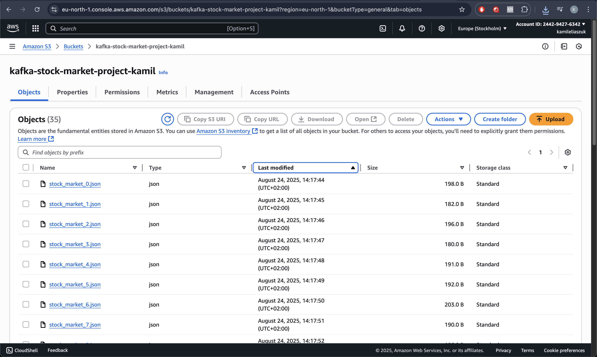
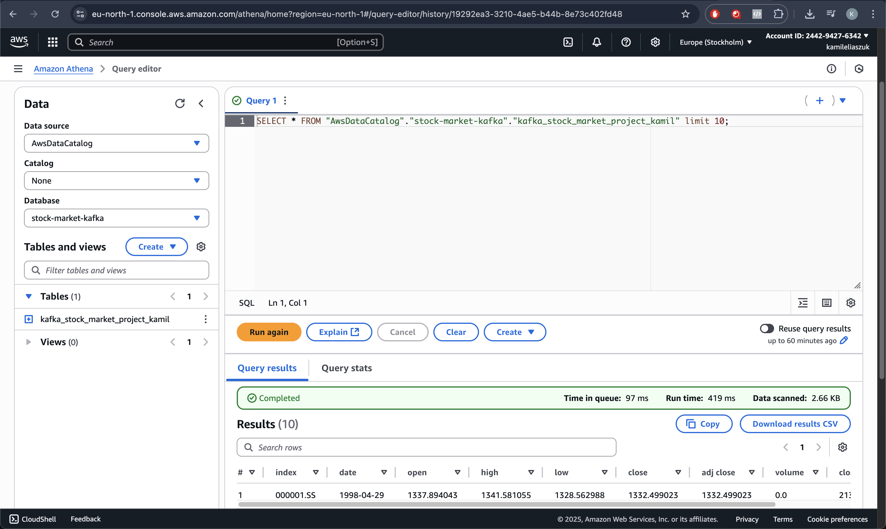

# Kafka Stock Market streaming
This project demonstrates a simple data pipeline using Apache Kafka to stream stock market data, store it in AWS S3, and query it using AWS Athena. The pipeline consists of a Kafka producer that generates random stock market data and sends it to a Kafka topic, and a Kafka consumer that reads the data from the topic and writes it to S3 in JSON format.

